# Cloud-Native E-commerce Platform on AWS EKS

This repository contains the source code and infrastructure definitions for a complete, cloud-native e-commerce platform. The project is built on a distributed, 3-tier microservices architecture and is designed to be deployed and managed on Amazon Web Services (AWS) using modern DevOps practices.

The primary focus of this project is to demonstrate a deep, practical understanding of Infrastructure as Code (IaC), container orchestration with Kubernetes, and end-to-end CI/CD automation in a cloud environment.

---

## 🏛️ Architecture Overview

This application implements a classic **3-tier architecture** using a modern microservices pattern. All components are designed to be scalable, resilient, and independently deployable.

### Architectural Layers

- **Presentation Tier:** A modern React single-page application (SPA) provides the user interface. All traffic from the internet is routed through an **AWS Application Load Balancer (ALB)**.
- **Logic Tier:** The core business logic is broken down into multiple, independent **microservices** written in Go. These services are containerized with Docker and run inside an **Amazon EKS (Kubernetes)** cluster. The ALB forwards API requests to the appropriate microservice via a Kubernetes Ingress resource.
- **Data Tier:** The backend services communicate with various data stores and message brokers to manage state. This project uses **MongoDB** as its primary database, **Redis** for cart caching, and **RabbitMQ** for asynchronous order processing.

### Architecture Diagram (Mermaid)

<p align="center">
  
  

## </p>

---

## 🚀 Tech Stack

| Category                  | Tools & Technologies                                                                    |
| ------------------------- | --------------------------------------------------------------------------------------- |
| **Cloud & DevOps**        | AWS (EKS, ECR, EC2, VPC, ALB, IAM), Terraform, Kubernetes, Helm, Docker, GitHub Actions |
| **Backend**               | Go, Microservices                                                                       |
| **Frontend**              | React, TypeScript, Vite                                                                 |
| **Databases & Messaging** | MongoDB, Redis, RabbitMQ                                                                |

---

## ‎ ‎⚙️ Core Infrastructure & DevOps Concepts

This project was built with a strong focus on automation and cloud-native principles.

### 1. Infrastructure as Code (IaC) with Terraform

The entire AWS environment is defined declaratively using Terraform. This approach ensures a repeatable, version-controlled, and fully automated setup.

- **VPC:** A custom Virtual Private Cloud is provisioned with public and private subnets across multiple Availability Zones for security and high availability.
- **EKS Cluster:** An Amazon EKS cluster is created to serve as the container orchestration control plane.
- **Node Groups:** The EC2 worker nodes (`t3.medium`) are managed by an EKS Node Group, which handles scaling and recovery.
- **IAM:** All necessary IAM Roles and Policies for the EKS cluster, worker nodes, and service accounts are defined in code.
- **ECR:** A private Amazon ECR repository is created for each microservice.

### 2. Containerization with Docker

Each microservice (both Go backend and React frontend) is packaged into a lightweight, portable Docker container. This guarantees consistency between local development and the production cloud environment and simplifies the deployment process.

### 3. Orchestration with Kubernetes and Helm

Amazon EKS is used to manage the complete lifecycle of the containerized services.

- **Helm Charts:** Each microservice has its own Helm chart. Helm acts as a package manager for Kubernetes, allowing for versioned, templated, and easily repeatable application deployments.
- **Kubernetes Objects:** The charts define all necessary Kubernetes resources, including `Deployments`, `Services` for internal networking, `StatefulSets` for the data services, and `Secrets` for securely managing credentials.

### 4. CI/CD with GitHub Actions

A GitHub Actions workflow provides full Continuous Integration and Continuous Deployment for the backend services. On every `git push` to the main branch, the pipeline automatically:

1.  **Builds** the Go source code.
2.  **Creates** a new Docker image.
3.  **Pushes** the tagged image to the appropriate Amazon ECR repository.
4.  **Triggers** a zero-downtime rolling update of the corresponding deployment in the EKS cluster.

### 5. Ingress & Load Balancing with AWS ALB

External traffic is managed by the **AWS Load Balancer Controller**, an add-on running in the cluster.

- A Kubernetes `Ingress` resource is defined in the Helm charts.
- The controller detects this Ingress object and automatically provisions and configures an **AWS Application Load Balancer (ALB)**.
- **Path-Based Routing:** The ALB is configured with listener rules that route traffic to the correct backend service based on the URL path (e.g., `/api/cart` is routed to the `cart-service`).

### 6. Health Checks & Zero-Downtime Deployments

Kubernetes uses liveness and readiness probes to manage container health, enabling self-healing and zero-downtime updates.

**Readiness Probes**
A readiness probe signals when a container is ready to start accepting traffic. Kubernetes will not route traffic to a pod until this check passes. This is critical for preventing downtime during deployments.

_Example `readinessProbe` in a Deployment manifest:_

```yaml
spec:
  containers:
    - name: cart-service
      # ...
      readinessProbe:
        httpGet:
          path: /healthz
          port: 8083
        initialDelaySeconds: 5
        periodSeconds: 10
```

**Liveness Probes**
A liveness probe checks if a running container is still functional. If the probe fails, Kubernetes will kill the container and create a new one in its place.

_Example `livenessProbe` in a Deployment manifest:_

```yaml
spec:
  containers:
    - name: cart-service
      # ...
      livenessProbe:
        httpGet:
          path: /healthz
          port: 8083
        initialDelaySeconds: 15
        periodSeconds: 20
```

**ALB Integration**
The AWS Load Balancer Controller uses the pod's readiness state to determine the health of its targets. The Ingress resource must be annotated to use the correct health check path.

_Ingress annotation for ALB health checks:_

```yaml
metadata:
  annotations:
    alb.ingress.kubernetes.io/healthcheck-path: /healthz
```

**Verifying Health Status**
Use `kubectl describe` to see probe status and events for a specific pod.

_Command to check pod events:_

```bash
kubectl describe pod <pod-name> -n cloud-shop
```

Look in the `Events` section of the output for messages from the `kubelet` regarding probe failures or successes.

---

## 📖 API Endpoints & Functionality

The platform exposes a RESTful API, with each service responsible for its domain.

| Service              | Method   | Path                           | Description                               |
| -------------------- | -------- | ------------------------------ | ----------------------------------------- |
| **User Service**     | `POST`   | `/api/users/register`          | Register a new user.                      |
|                      | `POST`   | `/api/users/login`             | Authenticate and receive a JWT.           |
| **Catalog Service**  | `GET`    | `/api/products`                | Get a list of all products.               |
|                      | `POST`   | `/api/products`                | Create a new product (admin).             |
| **Cart Service**     | `GET`    | `/api/cart`                    | Get the current user's cart contents.     |
|                      | `POST`   | `/api/cart/items`              | Add an item to the cart.                  |
|                      | `DELETE` | `/api/cart/items/{productSku}` | Remove an item from the cart.             |
| **Checkout Service** | `POST`   | `/api/checkout`                | Process the checkout and create an order. |
|                      | `GET`    | `/api/orders`                  | Get the current user's order history.     |

---

## 🛠️ Local Setup & Deployment

Instructions for setting up and deploying the project.

### Prerequisites

- AWS CLI
- Terraform
- `kubectl`
- Helm
- Docker

### Deployment Steps

1.  **Configure AWS Credentials:** Set up your local environment with credentials for an IAM user with sufficient permissions.
2.  **Provision Infrastructure:** Navigate to the `/terraform` directory and run `terraform apply`. This will build the entire AWS environment.
3.  **Deploy Applications:** Trigger the GitHub Actions workflow by pushing a code change, or deploy manually by building and pushing all Docker images to ECR, then using `helm install` for each chart in the `/k8s/charts` directory.
4.  **Access the Application:** Once deployed, find the public URL by running:
    ```bash
    kubectl get ingress -n cloud-shop
    ```

## ⚠️ Important: Cost Management & Decommissioning

AWS resources are billed on a pay-as-you-go basis. To avoid incurring unintended costs, it is critical to delete all created resources after you have finished with the project.

### Key Cost-Generating Resources

The primary services in this project that incur hourly charges are:

- **Amazon EKS Control Plane:** Billed at a fixed rate per hour.
- **EC2 Worker Nodes:** The `t3.medium` instances are billed for every hour they are running.
- **NAT Gateway:** Has an hourly charge plus data processing fees.
- **Application Load Balancer (ALB):** Has an hourly charge.
- **EBS Volumes:** Any persistent storage for data services will incur costs.

### Project Decommissioning

Because this project uses Infrastructure as Code, the entire AWS environment can be destroyed with a single command. This will remove all the resources listed above in the correct order.

1.  Navigate to the infrastructure directory:

    ```bash
    cd terraform
    ```

2.  Run the destroy command:
    ```bash
    terraform destroy
    ```

**Note:** The destroy process will take 15-20 minutes. Occasionally, resources created by controllers inside Kubernetes (like the Application Load Balancer and its associated Network Interfaces) may not be deleted cleanly on the first attempt. This can cause the `terraform destroy` command to fail with a `DependencyViolation` error, requiring manual cleanup of the leftover resources in the AWS Console before running the command a final time.

## 📜 License

Licensed under the [MIT License](LICENSE).
